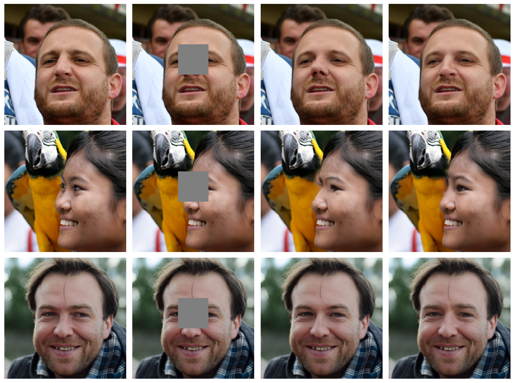

# Generative_Modeling_Project

Report containing the code and the report of the projet 5 [PSEUDOINVERSE-GUIDED DIFFUSION MODELS FOR INVERSE PROBLEMS](https://openreview.net/pdf?id=9_gsMA8MRKQ) of *Generative Models for image* @ MVA (B. GALERNE & A. LECLAIRE)



## Structure

```
Generative_modeling_project/
├── README.md
├── init.ipynb
├── setup.py
├── data/
│   └── __init__.py
├── figs/
│   └── __init__.py
├── ntbk/
│   ├── __init__.py
│   ├── evaluator.ipynb
│   └── tp_6.ipynb
├── src/
│   ├── __init__.py
│   ├── ddpm.py
│   ├── eval.py
│   ├── h_fcn.py
│   ├── h_utils.py
│   ├── pigdm.py
│   └── utils.py
└── tests/
    ├── __init__.py
    └── test.ipynb
```

* src: contains all the function of the project
* figs: contains some outputs of the model
* tests: sandbox with jupyter notebooks
* ntbk: notebooks to present our main results and how to reproduce them
* data: containing all the data and the pre trained models

## Get Start

First, please run:
```bash
chmod +x init_repo.sh
```

Then 

```
./init_repo.sh
```

from a terminal. Or simply run the whole notebook ``init.ipynb`` to download the packages, the pre-trained models and the data


## Experiments

To reproduce the experiments, you can either start the files in ``ntbk/`` and run them or execute the following commands

```bash
cd scripts
```

Config the parameters on the file ``config.yaml`` then run:

```bash
python evaluator.py
```

/!\ Important: In the notebooks and script, we refer to $\Pi GDM$ as "pigdm" and $DPS$ as "ddim", even though ddim is the name of the sampler, we consider that dps is the baseline so every variable named as ddim refer to dps !!

The official implementation of $\Pi$GDM can be found [here](https://github.com/NVlabs/RED-diff/tree/66482f23e242bb31166c3662002d0a6f9f065030)